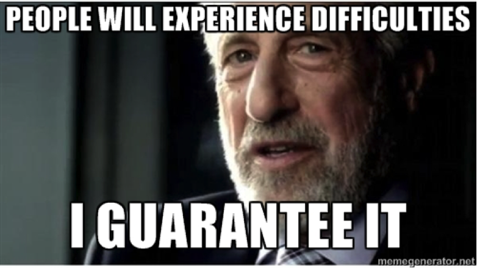
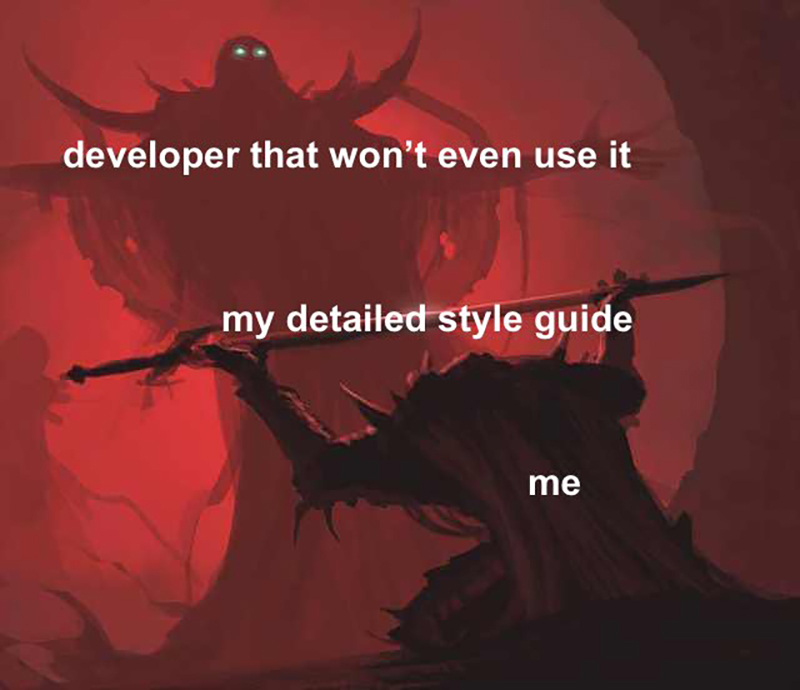
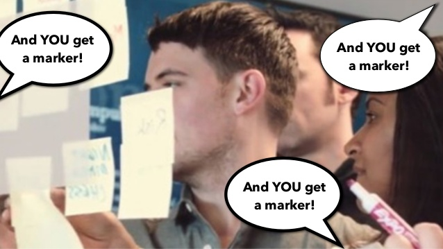

Good designs can solve complex problems by abstracting away the complexity from users. I was always fascinated by the fact that how design blinds the complexity with **beauty**, **simplicity**, and **clarity**. Before taking up my first job as a UX Engineer at [Locale.ai](https://locale.ai), I was curious about how visual design in digital products makes human interactions natural, and how these designs align with human psychology to make the experience seamless. After landing my first job in a startup, I was so excited to be part of a journey where the path defined by us. In this blog post series, I'll take you through our journey of designing a SaaS product. We'll talk about Lessons learned on every major decision we took in terms of design and research. The following points describe how I usually design in my day to day work and are highly opinionated :)

> "A problem well stated is a problem half solved" -  Charles Kettering, Head of Research at GM

## Understanding the problem
The most important step before solving any problem is to understand the problem in depth. Be sure about **what you are building** and more importantly **why you are building** it. _Because, you don't wanna design combs for the bald_. It's also part of understanding the problem to do more research on available solutions, how they built it and why is there a need for something better. 

To give you a better example, if you are building a product similar to Uber, you should always ask yourself and the customers you are targeting, why would anyone use your product instead of Uber? What are you doing better that will ultimately make users shift from Uber to your product? If you are not innovating in a market that's **well established**, it will be hard to sustain a product.

Your solution for the problem is your market. All the above pointers can be summed up to the term "Finding the Product Market Fit", which is identified as a first step to building a successful venture in which the company meets early adopters, gathers feedback and gauges interest in its product. You can read more about Product Market Fit from the [YC Blog](https://medium.com/r/?url=https%3A%2F%2Fblog.ycombinator.com%2Fthe-real-product-market-fit%2F) to understand your market better.

> "Design isn't finished until somebody is using it."  - Brenda Laurel

## Understanding your users
Design is not just about making things beautiful, it's the art of making things **usable**. If you are not aware of the people who are using your product, it will be nearly impossible to build something that your users will **love**. This is why User Research is one of the most important parts of designing a better User Experience for any product. It's all about knowing your users as much as possible, what do they do? how will they use your product? how much do they need your product? how much does your product solve their problem? how long will they usually use your product? there are a lot more questions you can ask just to understand your users and their behaviors.

As much as design is considered, this is an iterative process. You are not likely to hit a perfect "Mona Lisa" in your first shot. As Salvador Dali said, __"Have no fear of perfection, you will never reach it"__.
 Your designs should incorporate your users in every step with a continuous feedback loop. Sit together with them while they use your product, ask them to think out loud while they navigate through your product. Of course, this will only happen when you have a product to show your users. We'll talk more about that in-depth in upcoming sections.

Always keep in mind, **you are biased!** your problems are not the same as your user's problem. They are different. It's common practice to assume what your ideal users look like and what they need and you should stop doing that. The only way to know what your users need is to directly talk to them. Ask them questions, understand their goals, find out the pain points and prepare [User Personas](https://medium.com/r/?url=https%3A%2F%2Fcareerfoundry.com%2Fen%2Fblog%2Fux-design%2Fhow-to-define-a-user-persona%2F). A user persona is a fictional version of your ideal customer. It can be more than one, but it should be detailed so that it communicates the user needs effectively and helps you understand your users better. Once you have multiple user personas it will make the target users memorable to your product team throughout the journey and help them align to designing what your **users** needs.

Whenever you are planning to design a new feature, always ask this question to yourselves, your team and your users, **"Do we need it?"**. It's common for some people to just keep implementing new features without understanding what their users need. This might also cause problems if you are not concentrating on the priorities of solving the problem. _You don't need bells and whistles if your train isn't running_.

>"The next big thing is the one that makes the last big thing usable."  - Blake Ross, Co-creator of Mozilla Firefox

## Researching for solutions.
You don't need to reinvent the wheel. Whenever you are designing something, it's highly likely that someone else has already tried. There might be an existing solution, or there might be something similar to what you are designing. Explore the interwebs and find as many inspirations as possible. [Pinterest](https://pinterest.com), [Dribbble](https://dribbble.com), [Behance](https://behance.net) and [UpLabs](https://uplabs.com) are my go to places to find inspirations. If you are designing a product, look at your competitors and find out how they have solved the problem.

While designing products, especially digital products, you need to keep an eye on every small detail of your product. It's not an ideal solution to just reinvent the wheel every time you encounter a design problem. Use as much as standard principles as possible. Designing a login screen? Make sure you read about best practices. Designing a complex form? Make sure you learn about the steps or methods involved in breaking them down and making it easier for the user.

Finding inspirations from the internet can be a **double edged sword** most of the time. A really good visual design might not always be easily implementable. Or, all those eye-candy UI interactions you see on dribble might not make any sense when you consider the UX. You need to look into both the sides, the good and the bad. If you are researching existing products or methods, make sure you also learn about the limitations and drawbacks of them. This will give you a fair advantage in **designing better products**. 

Keep note of the interesting and best design decisions that you have found during your research. Learn about why those decisions are made and what were the trade-offs of implementing that design. Before you start designing anything, think about your users. Think how will they use it, run the design outcomes with the user personas and have a chat with your team or a user to know whether they like those designs.

>"Design is intelligence made visible"  - Alina Wheeler

## Action! Building a prototype.

It's time to bring your research to life! Once you have gathered enough insights and built an ideal mind map of the design, it's time to see it in action. Being a UX designer, there are tons of tools in wild which will make our lives easier. If you have a bit of experience in programming, you might have heard the term "Think twice, code once!". As a UX Engineer, who designs and builds the ideas into product, it's important for me to experiment a lot with designs before getting into code. Even before finalizing a design and handing over to the developers, it is important do it inside a feedback loop. 

Gain mastery in tools like Figma, Adobe XD, Sketch etc to quickly build a mock up of what's in your mind. If you are working in a startup, you will be always racing against time. Experimenting ideas real quick and gathering feedback will help you refine the ideas into working prototypes fast. If your job is only design, make sure to gain feedback from the developers to know about the feasibility of implementing such designs from initial phase itself. This will help the team to build out features even faster without leaving any gap for miscommunications.

These days, designers are also considered as product designers who envision the future of the product. But it also highly depends upon the kind of team you are working on. If you are new to UX designing, make sure every major feature you have prototyped hits the perfect feedback flow before landing into the actual product. It is also important to have knowledge about how certain aspects of visual elements are to be designed based on any given context. Whether to use a drop down or a radio buttons, tabs or side navigation list's or grids, and more. There are many research articles from famous designers on these concepts. Make sure you have done a fair amount of googling when you feel a bit ambiguity on which element suits good to implement and where. We'll have a detailed discussion about some of these concepts in my upcoming posts.

If you are building for web, I'd highly recommend reading the book "Don't Make Think" by Steve Krug. He explains about best practices in web usability and gives a better understanding of how people use the internet.

> "I think it's very important to have a feedback loop, where you're constantly thinking about what you've done and how you could be doing it better." - Elon Musk

## Feedback and back to the loop.
Feedback is crucial to shape your design to match your user needs. But keep in mind, **not all the users are same**. Every user you have will be unique. If you are building for the web, you can never be sure about what your users think while using your product. There might be users who are really experienced with using the internet, or there might be people who just got into using the internet. There are people who doesn't like certain colors, and there are people who just prefers one color of their choice everywhere. It will be chaos if you go out to design for everything. This is where the common design principles come into picture followed by user feedback. 

Make sure your designs are accessible for vast majority of your users with no modifications. Whenever you get the feedback, thoroughly evaluate the response if it affects just a group of people or is it something that affects every user. Always try to include changes that are targeted to everyone and not to just the majority of your users.

You know too much about your product and it's design. But when you get feedback from a user who have never seen the designs, it is likely to be unbiased. But, it's not just the users who will give you feedback. As a designer, everyone in your team will have their own imagination of the product. All you gotta do while having a design review is, not to lead it to a religious debate. What I meant by religious is; the CEO, the marketing team, the developers and the designers have different perspective of designing a product. Sometimes, the feedback reviews tend to be about their own personal preference without any principles to back it up. Exactly how people debate about religion. This is where you need to quickly test out the theories. 

Testing is inevitable when it comes to having a good design. There might be a lot of likes and theories among your team which needs to be incorporated but doesn't seem acceptable by many others. In such situations, designing an alternate version quickly and testing it out with more feedback from users will solve the problem. There might be a few ideas and feedback suggestions which will play out to be better than current design. Even though it might not make sense to us in the first place, testing the theories will put an end to unwanted arguments and discussions.

With all the feedback you have gained, analyzing and prioritizing it for new changes, the loop continues.

