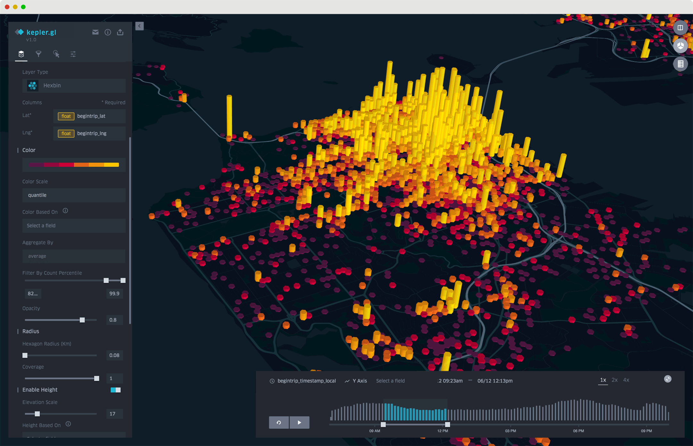
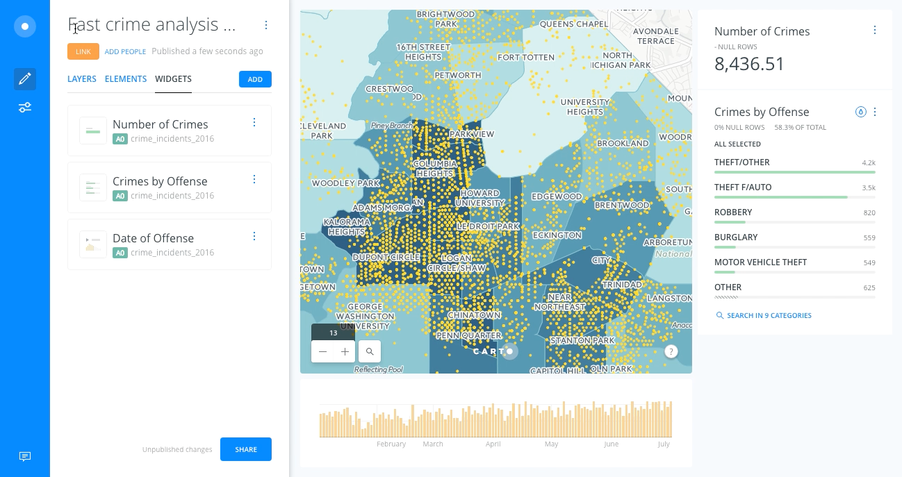
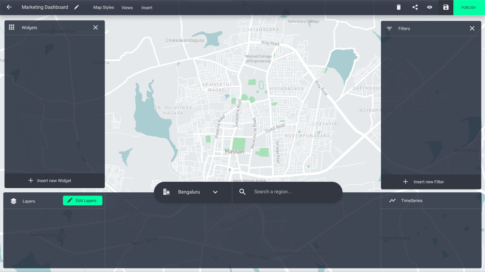
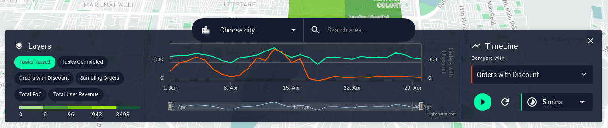
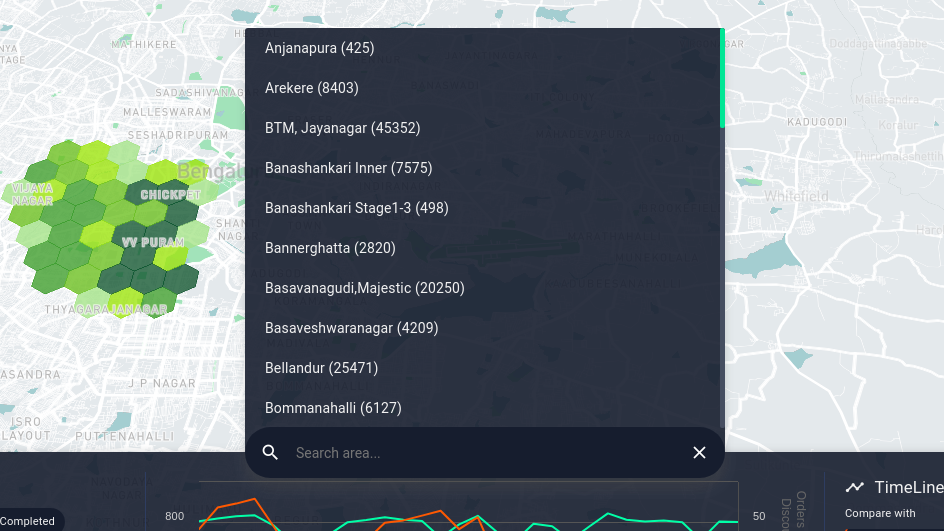
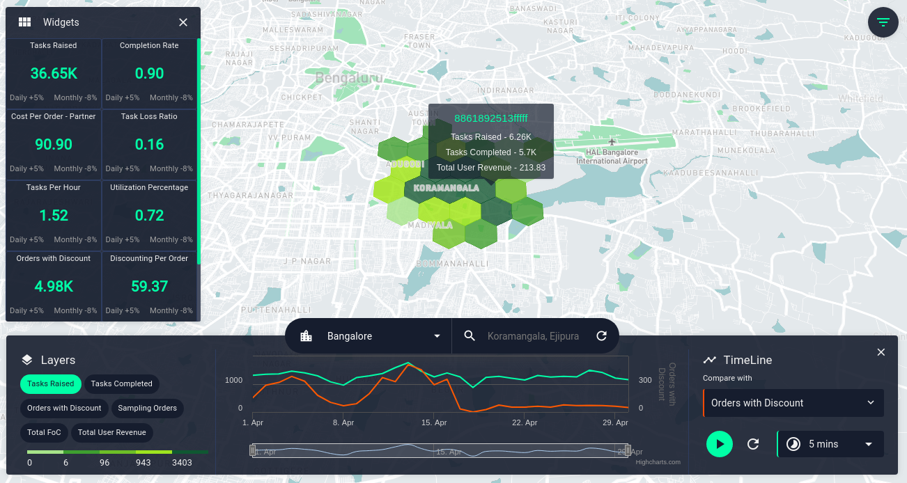
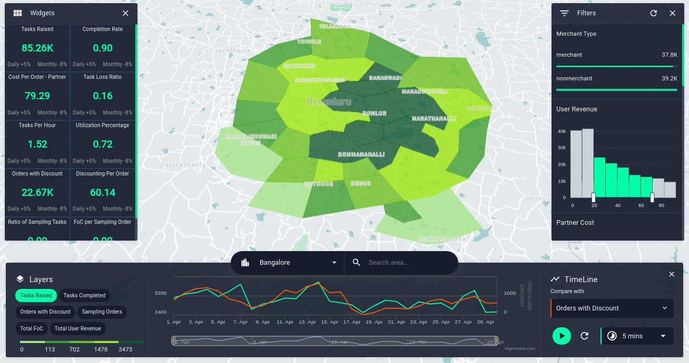
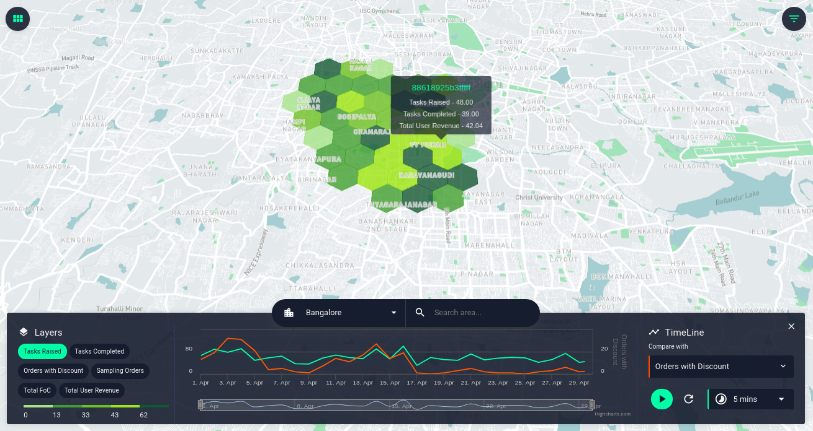
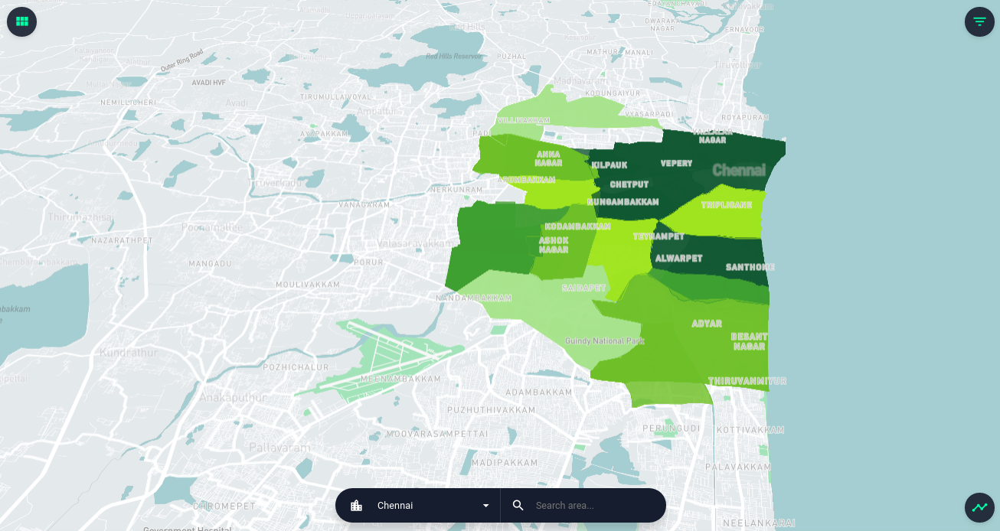

Having an overall view of your business, or system can give you a lot of insight about how well each part of your system is performing. This helps business users or anyone associated to take quick and strategic decisions. Dashboards and dashboarding tools isn't just a magic wand for a particular field, it is a general solution for most of the **visibility problems** exist in any organisation, business or system. From monitoring the status of space crafts using live dashboards to tiny dashboards within apps that shows your daily calories burned, they are everywhere!

**What makes a dashboard great?** Dashboards help users to answer the three of four **W**s of information. The What, When and Where. The "Why" of the information is upto the user to figure out since it requires logical reasoning and a bit of intelligence. If a dashboard can convey the overall status of your system with all the three **W**s, we can say it did a good job. But, Throwing bars and pies at a user with a ton of numbers within a single screen doesn't sound like a "Great Job". Unfortunately, most of the dashboards today looks like the 90's retro consoles with neumerous widgets and graphs which makes it really difficult to grasp the overall information about your system **at a glance**.

## Geo-Spatial Dashboards

It's a type of dashboard which has a Place and Time component to convey information. Think about it from a delivery comapny's perspective, they use these dashboards to see where their delivery partners and how well they are performing. Or, GeoSpatial dashboards which helps in displaying the weather and natural disaster areas over time. These aren't mainstream dashboards, becasue these dashboards require large amount of data to be displayed in the Map or a timeline, they become bulky and heavy. The main focus on these type of dashboards are on the **Location component (Maps)** and **Time component (Timeline)**. These two components are interconnected to give the user a better idea about how geo properties change over time.

At [Locale.ai](https://locale.ai), we work extensively on building geo-spatial dashboards to help on-demand companies to have an overall view of their partners and assets on ground in realtime. One of the biggest challenges while building these dashboards are the large amount of information associated to each other to be displayed on the screen. Considering the two major components of a geo-spatial dashboards as a Map and a Timeline, it is a challenging task to find **screen space** to accomodate all the tiny widgets which shows one or the other **Key Performance Indicators (KPIs)** of the client's company.

## Loooking for inspiration

Maps are at the heart of geo-spatial dashboards and are considered to be as of high priority when allocating screen-space, next comes the timeline and then all other widgets. Initially our designs were inspired by some of the well known geo-spatial visualisation platforms like [Kepler](https://kepler.gl) and [Carto](https://carto.com), but we found a lot of limitations while analysing each of these platforms. 

Kepler.gl GeoSpatial visualisation

Kepler has one of the well polished interface, even though it is an opensource project. All credits for the uber engineers!. From a business user's perspective the one-more-click away filters view and the disconnected timeline view was enough to reconsider a better way to build a geospatial dashboard. Adding to that, kepler doesn't provide out of the box options to view other metrics or connect your database for any heavy visualisation. Everything is done using a user supplied CSV file. Kepler gave us a fine grain understanding of the controls and visualisations aspects required for building a better geospatial console/dashboard.

Carto dashboard

Carto has been in the geo spatial visualisation space for quite a while and matured to understand the nuances of geo spatial analytics. Their dashboaring platform is quite intuitive and designed to have an easy, self-assisted experience for users. Few of the drawbacks we found in carto were the small screenspace provided for the map and the timeline view which is fairly disconnected from all the other controls without any in depth filtering on time. When dealing with realtime data and historical data at the same time, it is important to have the ability to slice and dice data with in every minute.

## Designing the dashboard

After reviewing the available tools out there, after a lot of user research and iterations on how business users analyze location data in their organisation, we had got a clear idea of the dos and donts. Our main goal while building the [locale.ai](https://locale.ai) platform was to make it easier and intuitive for anyone without much technical knowledge to be able to use the consoles and dashboards. Giving maximum space for clear geo visualisation and connecting the layers and timeline together to give a better context of whats being displayed on the map was of our atmost priority.

Locale.ai Initial Layout planning and designing

Our initial designs were to couple together the layers panel and timeline associated with it in one place. Since the layers change with time, users need to see the controls related to layers and timeline right in one place.

Locale.ai Layers and timeline

One more thing we included with the bottom layers+timeline panel is the search functionality. Search in our case was a bit different since cities and regions act as an added filter plus the selected city and region should be always visible near the visualisation. The right place to bring all the main controls together was to add it along with the layers and timeline. 

Locale.ai Search bar

Next stop! Designing the widgets to display the main KPIs associated. As we humans tend to read things from left to right, the first position we look on the screen is the top left corner. This seemed like a really good position to place all the widgets together since users need a clear visibility of how these metrics change with any of the filters applied.   

Locale.ai widgets panel

And finally adding the filters section on the right side of the screen. All these things together gives an easy access to anything you could think of in a geo spatial console.

Locale.ai final dashboard design implementation

As I mentioned in the begining of the post, Map and timeline needs to be the main focus. I implementd shortcuts to easily hide and show all the panels on the dashboard, giving maximum visibility on the visualisation whenever it's needed. To persist the context of the visualisation, the search bar is always visible displaying the selected city and region.

Locale.ai timeline view of dashboard

Locale.ai full map view with search bar

## Change is inevitable!

This build of locale.ai platform is one of the most loved design by our clients. We had to go through almost 5 design iterations to reach this stage and all the decisions we took along the way. As a startup we always belive in experimenting a lot before reaching the final result, and change is inevitable when it comes to product design. This is in no way will be our best design as we are trying to improve our platform every now and then with constant feedback from our customers.

> Change means that what was before wasn't perfect. People want things to be better. ~ Esther Dyson

There are still more aspects of this dashboard to fix and design better user experience. We are open for feedbacks and suggestions :) Our new designs is under constant development and improvement on bringing all the related components in the dashboard together with added functionality to switch from dark mode to night mode.

Do you like working with maps and visualisations? Check out the [Locale.ai blog](https://locale.ai) for more amazing contents on geo-spatial visualisation.

